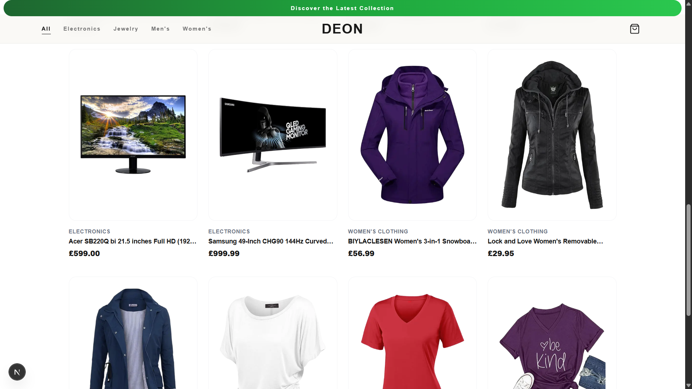

# DEON Store

DEON is a responsive storefront built with Next.js. It loads product data from the Fake Store API and lets shoppers browse the catalogue by category, inspect product cards, and add products to a client-side cart.



## Project Links
- **GitHub repository:** [github.com/gideonabe/dynamic_frontend_store](https://github.com/gideonabe/dynamic_frontend_store)
- **Live deployment:** [https://dynamic-frontend-store.vercel.app](https://dynamic-frontend-store.vercel.app)

## Features

- Product catalogue populated from the Fake Store API
- Category filtering for electronics, jewelry, men's clothing, and women's clothing
- Client-side cart state managed with React context
- Responsive product grid for desktop and mobile layouts
- Accessible product cards, navigation, status messages, and skip link
- Loading and error states for the main product view
- Runtime rendering for the home page so deployment builds do not depend on the external API being available during prerendering

## Technical Notes & Architecture Decisions

### Bypassing Cloud Hosting Blockades (FakeStoreAPI 403 Forbidden Error)

During production deployment on Vercel, the application initially encountered `403 Forbidden` network errors when executing server-side data fetches. 

#### The Problem
`FakeStoreAPI` utilizes strict infrastructure firewall policies (managed via Cloudflare) that flag and completely block incoming traffic originating from well-known cloud hosting IP ranges (Vercel, Netlify, AWS, etc.) to prevent automated scraping or denial-of-service abuse. While server-side data fetching (`getServerSideProps`, Server Components, or internal API proxies) worked perfectly on `localhost`, it failed reliably on the live production server.

#### The Solution (Client-Side Hydration)
To bypass this limitation without sacrificing UX, data fetching was migrated entirely to **Client-Side Fetching** using React's `useEffect` hook. 
* By shifting the network request to the client side, API requests originate natively from the end-user's residential or mobile internet IP address rather than the cloud network.
* **Layout Shifts & UX Prevention:** To prevent structural layout pops while the client fetches the API payload, the client-side state hooks smoothly handle loading boundaries by rendering a localized, accessible SVG skeleton loader (`loading.tsx`) until the component completely hydrates.

### Image Optimization & Core Web Vitals (LCP)

To prevent Lighthouse warnings regarding **Largest Contentful Paint (LCP)**, image prioritization is calculated dynamically based on layout position rather than applying blanket settings:
* **The Problem:** Setting `loading="eager"` or `priority` on all 20 store items causes massive bandwidth waste. Conversely, leaving them all on default lazy-loading forces browsers to delay fetching above-the-fold images, destroying the LCP score.
* **The Solution:** The grid passes a conditional boolean property (`priority={index < 4}`) to the image components. This tells Next.js to pre-render and prioritize the first four visible hero cards immediately, while automatically lazy-loading the remaining 16 items beneath the fold.


## Technology

- Next.js `16.3.4` with the App Router
- React `19.2.8` and TypeScript
- Tailwind CSS v4
- Lucide React icons
- Fake Store API: `https://fakestoreapi.com`


## Run Locally

Requirements: Node.js 20 or newer and npm.
```bash
npm install
npm run dev
```

Open [http://localhost:3000](http://localhost:3000).

## Available Scripts

```bash
npm run dev      # Start the development server
npm run build    # Create a production build
npm start        # Serve the production build
npm run lint     # Run ESLint
```
## Deployment

This is a standard Next.js application and can be deployed to Vercel, Netlify, or another Node.js hosting provider that supports Next.js server rendering.

For Vercel:

1. Import the GitHub repository into Vercel.
2. Keep the detected Next.js framework preset and default build command.
3. Deploy the `main` branch.
4. Add the resulting URL to the **Live deployment** link above.

The home route is configured as dynamic because product data comes from an external API. The deployment therefore needs a server runtime; it is not configured as a static export.
## Performance Report

### Lighthouse baseline

The following baseline was captured with Lighthouse against the local application at `http://localhost:3000` on September 8, 2026. Scores can vary with network conditions, API response time, device emulation, and whether the test is run against the deployed URL.

| Category | Score |
| --- | ---: |
| Performance | 95 |
| Accessibility | 96 |
| Best Practices | 100 |
| SEO | 100 |

| Metric | Result |
| --- | ---: |
| First Contentful Paint | 0.8 s |
| Largest Contentful Paint | 8.8 s |
| Total Blocking Time | 420 ms |
| Cumulative Layout Shift | 0 |
| Speed Index | 1.2 s |

### Findings and next steps

- Accessibility, best practices, SEO, and layout stability are strong in the local baseline.
- The main performance constraint is the 8.8 s LCP, which is affected by the external product API and remote product images.
- For a higher production score, measure the deployed URL on a mobile profile, then consider serving optimized image sizes, reducing image loading work above the fold, and using a first-party product-data cache or database.

## Project Structure

```text
app/          App Router pages, layout, loading, and error states
components/   Navbar, footer, product grid, cards, and store context
lib/           Fake Store API data access
public/        Static assets, including screenshot.png
types/         Shared TypeScript types
```

## Data and Error Handling

Product and category requests are defined in `lib/products.ts`. Product data is cached for one hour and categories for one day. The home page renders dynamically to avoid failing a deployment when the third-party API is temporarily unavailable during the build.
This is a [Next.js](https://nextjs.org) project bootstrapped with [`create-next-app`](https://nextjs.org/docs/app/api-reference/cli/create-next-app).

## Getting Started

First, run the development server:

```bash
npm run dev
# or
yarn dev
# or
pnpm dev
# or
bun dev
```

Open [http://localhost:3000](http://localhost:3000) with your browser to see the result.

You can start editing the page by modifying `app/page.tsx`. The page auto-updates as you edit the file.

This project uses [`next/font`](https://nextjs.org/docs/app/building-your-application/optimizing/fonts) to automatically optimize and load [Geist](https://vercel.com/font), a new font family for Vercel.